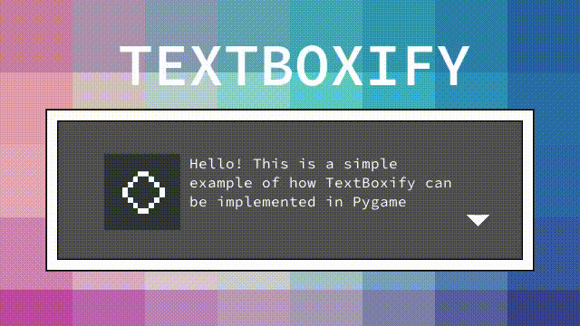

# TextBoxify

> Text and dialog box package for games created with Pygame.

[](https://www.pygame.org/)
[](https://github.com/psf/black)



TextBoxify is a package for easily creating text and dialog boxes in Python games written in [Pygame](https://www.pygame.org/). The package is aiming to give the users of the package a lot of control when it comes to designing the look and feel of their boxes.

## Setup

It's recommended to install the package in a virtual environment to avoid conflicts with different versions of the same packages.

1. Create virtual environment:

  `python -m venv [dir]`

2. Activate the virtual environment:

  `source [dir]/bin/activate`

3. Installation:

  `pip install textboxify`

  To install the code from Github, clone the repository and install it in editable mode `-e` to edit the code without having to reinstall it for the changes to have effect.

  ```
  git clone https://github.com/hnrkcode/TextBoxify.git
  cd TextBoxify
  pip install -r requirements.txt -e .
  ```

## Usage

To use the package just write `import textboxify` in your python modules and start using it.

## Example

This is how you could initialize and customize a dialog box with `TextBoxFrame`, which creates a dialog box with a border and optional features like animated portrait and idling symbol.

```Python
dialog_box = textboxify.TextBoxFrame(
    text=dialog_text,
    text_width=320,
    lines=2,
    pos=(80, 180),
    padding=(150, 100),
    font_color=(92, 53, 102),
    font_size=26,
    bg_color=(173, 127, 168),
)
```

Add these two lines to create a symbol indicating that the box is idle and a picture representing the character talking.

```Python
dialog_box.set_indicator()
dialog_box.set_portrait()
```

To implement the text box you could add it to a sprite group, like `pygame.sprite.LayeredDirty` because the text boxes are subclasses of `pygame.sprite.DirtySprite`.

To activate the textbox you then add the text box object to the sprite group.

```Python
if not dialog_group:
    dialog_group.add(dialog_box)
```

To deactivate it you removes it from the sprite group.

```Python
dialog_box.kill()
```

If you want to reuse the text box, you should first call `hard_reset()` and if you also want to set a new message call `set_text()`.

```Python
dialog_box.hard_reset()
dialog_box.set_text("Happy coding!")
```

For a working example of how to implement `textboxify` see the example module.

## Tests

Run all tests:

`python -m unittest discover -v tests` or `python -m unittest -v tests/test_*.py`

Run specific tests:

`python -m unittest -v tests.test_settings`

`python -m unittest -v tests.test_settings.TestSettings`

`python -m unittest -v tests.test_settings.TestSettings.test_file_exists`
